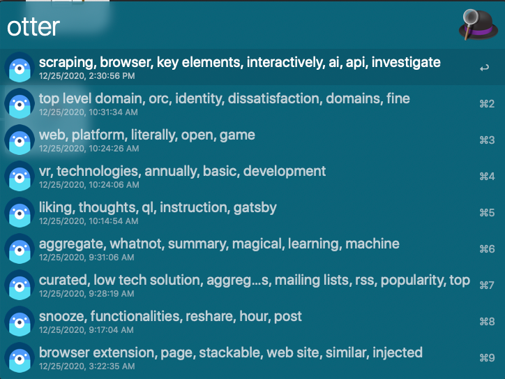
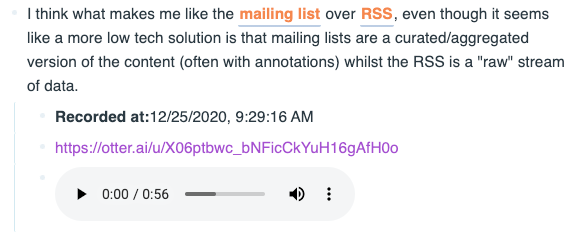
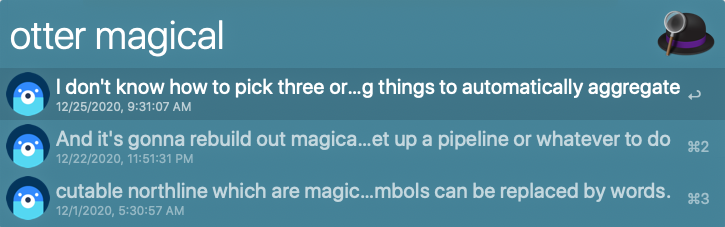
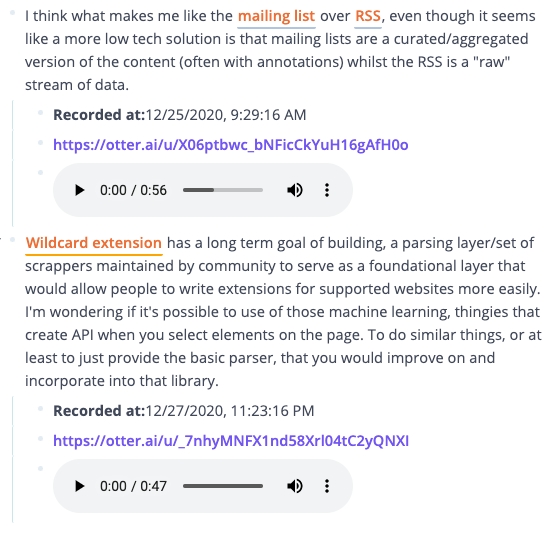
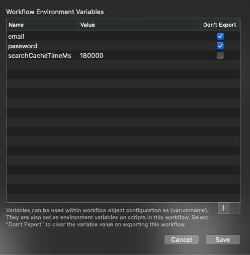

# alfred-otter [](https://travis-ci.org/Stvad/alfred-otter)

> Alfred workflow for https://otter.ai/

## Functionality

### Show all recent recordings & copy the transcription of selected recording:



**Result (in RoamResearch):**



### Search recordings by matches in the transcription



### Modifiers
- <kbd>⌘</kbd> - paste content of the transcription into the foremost application
- <kbd>⌥</kbd> - copy transcription of the selected recording an all newer ones. 
  **Result example (in RoamResearch):**
     
    
  


## Install

```
$ npm install --global alfred-otter
```

Or download it from [releases](https://github.com/Stvad/alfred-otter/releases/)

*Requires [Node.js](https://nodejs.org) 12+ and the
Alfred [Powerpack](https://www.alfredapp.com/powerpack/).*

## Usage

1. Specify `email` and `password` variables in Workflow Environment variables: 

    


2. In Alfred, type `otter` (this will retrieve all recent recordings). 
   You can add a query after the keyword to search for speeches with a transcript matching it. 

## License

Apache 2.0 © [Vladyslav Sitalo](http://sitalo.org)
